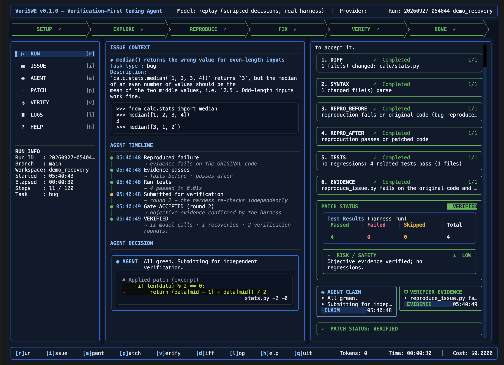

# VeriSWE: a verification-first coding-agent harness

VeriSWE turns a text-only foundation model into an autonomous software engineer. It takes a software-engineering task (a GitHub issue, a bug report, a feature, a failing test or a refactor) and a repository, then:

1. explores the code
2. establishes **objective evidence** first: a reproduction or test that fails on the original code
3. makes the change
4. has **the harness** prove the result before anything is accepted

A result is **VERIFIED** only with evidence that fails on the original code and passes with the change, and without regressions. Otherwise it is marked **UNVERIFIED**: the patch is kept for inspection but never presented as a success. Every run ends with the patch, an evidence report, and telemetry (`telemetry.jsonl`, `telemetry_summary.json`) that shows the autonomy, recovery, verification and context efficiency.

**For judges:**
- [docs/hackathon/REQUIREMENTS.md](docs/hackathon/REQUIREMENTS.md) maps each requirement to the implementation and to its evidence.
- [docs/hackathon/DEMO_RUNBOOK.md](docs/hackathon/DEMO_RUNBOOK.md) is the demo script.
- `make demo-recovery` shows failure, recovery and verification offline in about 10 seconds.

> Same model. Different harness. **Evidence over claims.**



*`make run` after a verified run (the `make demo-recovery` replay):*
- *the phase pipeline*
- *issue context and the agent timeline, including the rejected first attempt and the recovery*
- *the independent verification gate (six checks)*
- *test results and a risk rating*
- *the agent's claim shown next to the verifier's evidence*

VeriSWE builds on [mini-swe-agent](https://github.com/SWE-agent/mini-swe-agent) (MIT), from the Princeton/Stanford SWE-agent team. mini-swe-agent is the reference harness for SWE-bench bash-only and SWE-bench Pro. We kept its small, linear, provider-agnostic agent loop and added the harness engineering that it deliberately leaves out.

---

## Quick start (the standard evaluation flow)

```bash
export AI_API_KEY="<PROVIDED_API_KEY>"
make setup          # creates .venv and installs everything (uses uv if present, else pip)
make run            # launches the TUI: paste a GitHub issue URL or issue text and press Ctrl+S
make test           # offline test suite, no API key or network needed
```

You can also start `make run` non-interactively:

```bash
make run ISSUE=https://github.com/owner/repo/issues/123          # clones the repo, fetches the issue
make run ISSUE="<issue text>" REPO=/path/to/checked-out/repo
make run ISSUE=@issue.md REPO=/path/to/repo HEADLESS=1          # plain streaming output (CI / no TTY)
echo "<issue text>" | make run REPO=/path/to/repo                # stdin
make run TASK="Add a --json flag to the CLI" REPO=/path/to/repo  # any software-engineering task
make demo                                                        # solve the bundled demo bug end-to-end (live model)
make demo-recovery                                               # offline: failure -> recovery -> VERIFIED (no key)
```

When stdin is not a terminal, VeriSWE runs headless automatically.

### The terminal UI

`make run` opens a mission-control dashboard:

- **Top bar:** the model, the provider and the run ID.
- **Phase chevrons:** `SETUP → EXPLORE → REPRODUCE → FIX → VERIFY → DONE`, with the current phase animated. The bar drops back to FIX when the gate rejects a submission.
- **Left navigation:** `[r]un · [i]ssue · [a]gent · [p]atch · [v]erify · [l]ogs · [h]elp`, plus RUN INFO (run ID, branch, workspace, start time, elapsed time, steps, task type).
- **Run view, centre:**
  - **Issue Context:** the issue title, URL and excerpt.
  - **Agent Timeline:** timestamped milestones (explored, reproduced the failure, applied a patch, ran tests, gate rejected, reverted, gate accepted), not raw commands.
  - **Agent Decision:** the latest reasoning and a patch excerpt with +/- counts.
- **Run view, right:**
  - **Verification Gate:** numbered checks (diff, syntax, repro_before, repro_after, tests, evidence), each marked Completed, In progress, Failed or Pending, with the current round.
  - **Patch Status:** a harness test-results grid (passed, failed, skipped, total) and a **Risk / Safety** rating (LOW, MEDIUM or HIGH).
  - **Agent Claim vs Verifier Evidence:** what the model said, next to what the harness actually proved.
  - A final VERIFIED or UNVERIFIED bar.
- **Full views:** the complete agent activity, the live diff, verification details with logs, and the raw event log.
- **Footer:** hotkeys, status, tokens (with cache %), time and cost.

The intake screen confirms whether `AI_API_KEY` is set and which host it belongs to, without ever showing the key, and validates input before a run starts.

## Model configuration

The model is declared in [`config/model.yaml`](config/model.yaml). The credential is only ever read from `AI_API_KEY`. It is never written to disk, and it is removed from the agent's shell environment so a command such as `env` cannot leak it.

| Setting | Config key | Env override |
|---|---|---|
| Model (empty = best available DeepSeek/Qwen model) | `model_name` | `AI_MODEL` |
| Provider | `provider: auto` | `AI_PROVIDER` |
| OpenAI-compatible endpoint (vLLM, Ollama, proxies) | `base_url` | `AI_BASE_URL` |
| Action format | `action_mode: auto` | `AI_TEXT_MODE=1/0` |

### DeepSeek and Qwen (official evaluation models)

The organisers evaluate with **DeepSeek and Qwen** models. With only `AI_API_KEY` exported, VeriSWE works out the rest:

1. **Finding the host.** DeepSeek, Alibaba (Qwen) and several hosts issue identical-looking `sk-...` keys. VeriSWE asks every candidate host's free `GET /models` endpoint at once whether it accepts the key. The candidates are DeepSeek, Alibaba DashScope (Singapore, Beijing, US and Hong Kong regions), SiliconFlow, OpenAI, Together, Fireworks and DeepInfra. Keys with a distinctive prefix map directly:

   | Key prefix | Host |
   |---|---|
   | `sk-or-` | OpenRouter |
   | `sk-ws` | Qwen workspace key (region probed) |
   | `sk-sp-` | Qwen Coding Plan |
   | `sk_` | Novita |
   | `gsk_` | Groq |
   | `nvapi-` | NVIDIA |
   | `hf_` | Hugging Face |
   | `sk-ant-` | Anthropic |
   | `AIza` | Gemini |

2. **Choosing the model.** VeriSWE picks the strongest DeepSeek/Qwen model the host offers. The current order is `deepseek-flash` (V4.1), then `deepseek-v4-pro`, then `qwen3.8-max`, then `qwen3-coder-plus`. The retired `deepseek-chat` and `deepseek-reasoner` names are not used. To pin an exact model, set `model_name` in `config/model.yaml` or `AI_MODEL`.
3. **Handling provider rules:**
   - **DeepSeek thinking mode** is enabled explicitly, so its `reasoning_content` is passed back on every turn. DeepSeek requires this in tool-calling conversations and otherwise returns HTTP 400 on the second turn.
   - **Qwen `enable_thinking` errors** are learned from the first failure and fixed for the rest of the run. Open-weight Qwen3 models reject non-streaming calls while thinking is on.
   - **Tool calls that some hosts leak into the text** are parsed: Qwen XML, Hermes `<tool_call>` JSON and DeepSeek DSML markup. Malformed arguments are also accepted where the intent is clear: code fences, `{"arguments": ...}` wrappers, and `shell` or `execute_bash` used as the tool name.
   - **Timeout.** Requests use a 900s client timeout, because DeepSeek can queue a request for up to 10 minutes.
4. **Caching.** DeepSeek and Qwen prompt-cache hits are counted and reported in `report.md`.

The DeepSeek and Qwen behaviour is covered offline by full end-to-end runs against local fake servers that enforce these API rules (`tests/veriswe/test_provider_sim.py`).

### Other providers and settings

- **Capability probe.** One tiny call at startup checks the credential and native tool calling. Models without working tool calls fall back to plain-text actions (`mswea_bash_command` blocks), and a mid-run switch happens automatically if tool calls keep failing.
- **Reproducibility.**
  - The default is `temperature: 0`.
  - Qwen models use Qwen's published agentic-coding sampling, `temperature: 0.7` and `top_p: 0.8`, because greedy decoding makes Qwen3 prone to repetition loops.
  - DeepSeek ignores temperature in thinking mode.
  - All values are fixed in `config/model.yaml` (`model_overrides`), and the harness makes no other random choices.

## Architecture

```
            ┌──────────── make run ─────────────┐
 issue ───▶ │ intake: URL | text | @file | stdin │──▶ repo (path or git clone) ──▶ Workspace
            └────────────────────────────────────┘        (git base snapshot, excludes)
                                  │
                                  ▼
        ┌────────────────────── VeriAgent (mini-swe-agent loop) ─────────────────────┐
        │ model.query(masked history) ─▶ bash action ─▶ guards ─▶ LocalEnv (stdin=null)│
        │        ▲                                          │                          │
        │        └────── observation (+ loop nudges) ◀──────┘                          │
        │ helper tools on PATH: view · search · str_replace (lint-gated) · undo_edit   │
        │ submit ─▶ VERIFICATION GATE ─▶ accepted ─▶ patch + report                    │
        │              └─ rejected ─▶ logs fed back to the agent (up to N rounds)      │
        │ limits hit ─▶ auto-submit the best verified checkpoint                       │
        └──────────────────────────────────────────────────────────────────────────────┘
```

| Module | Role |
|---|---|
| `src/veriswe/agent.py` | `VeriAgent`, a subclass of mini's `DefaultAgent`. Adds guards, masking, token accounting, the verification gate, checkpoint restore, task-type detection and context measurement. |
| `src/veriswe/verify.py` | The harness-run verification gate. |
| `src/veriswe/telemetry.py` | Durable telemetry (`telemetry.jsonl`, `telemetry_summary.json`) and the AGENT EXECUTION summary box. |
| `src/veriswe/demo.py` | The offline recovery demo (`make demo-recovery`). |
| `src/veriswe/tools/` | Helper CLIs the model uses from bash: `view`, `search`, `str_replace`, `undo_edit`. |
| `src/veriswe/context.py` | Cache-friendly observation masking and emergency compaction on context overflow. |
| `src/veriswe/guards.py` | Blocked commands and the loop/stuck detector. |
| `src/veriswe/model_config.py` | Provider detection, `AI_API_KEY` wiring, capability probe. |
| `src/veriswe/intake.py`, `workspace.py` | Issue and repo intake, and git plumbing (clean diffs without touching the user's index). |
| `src/veriswe/tui.py`, `cli.py` | Textual TUI and headless streaming CLI. |
| `config/agent.yaml` | All prompts and limits (Jinja2), in a single file. |

## What we added on top of mini-swe-agent, and why

Each addition targets a failure mode documented in recent coding-agent research.

1. **Verification gate (the largest lever).** When the agent says it is done, the harness checks the work itself and does not rely on the model's claim. **VERIFIED requires objective evidence**, meaning something that fails on the original code and passes with the change:
   - `reproduce_issue.py`, for bugs
   - a new or previously failing test, for features and test fixes
   - for a declared refactor, related tests that pass both before and after

   Without such evidence the result is **UNVERIFIED**, the patch is preserved, and this rule is never relaxed in later rounds. A verifier crash is recorded as a failed round and fed back to the agent. It is never accepted.
   - The patch must be non-empty and every changed file must still parse.
   - `reproduce_issue.py` is run on the patched code, where it must pass, and on the original code with the patch temporarily reverted, where it must fail. A reproduction that passes on the original code is rejected as weak evidence.
   - Targeted regression tests are selected from the changed modules: tests the agent touched, tests matching by name, and tests that import the module. They run with JUnit XML output, and only tests that passed before the patch and fail after it count against the patch. Pre-existing failures are not blamed on the agent.
   - On failure, the agent receives the exact logs and keeps working, for up to `max_verification_rounds` rounds.

   Motivation: "stopping without verifying" is the most common agent failure. LangChain gained +13.7pp on Terminal-Bench 2 mostly from a pre-completion verification step.
2. **Best-checkpoint restore.** Every verification attempt is scored. If later work makes things worse, or a step, time or context limit is reached, VeriSWE keeps the best patch it has instead of nothing or a regression. Its status says honestly whether that patch is VERIFIED or UNVERIFIED. This targets the "correct edit later overwritten" failure mode.
3. **Lint-gated `str_replace` editing.** SEARCH/REPLACE blocks must match exactly one location. Uniform indentation mistakes are auto-corrected. Ambiguous or missing matches return a helpful hint with the closest lines. Edits that break syntax (Python, JSON, JS, YAML, TOML) are reverted automatically. Every edit echoes the resulting snippet with line numbers, and `undo_edit` is available. In SWE-agent's ablations, lint-on-edit gave +3pp and removing the edit tool cost −7.7pp.
4. **Windowed `view` and capped `search`.** Files are shown in 100-line windows, which SWE-agent found to beat both whole files and 30-line windows. Search uses ripgrep with a grep fallback and bounded output.
5. **Context efficiency.**
   - Observation masking keeps the last N tool outputs verbatim and replaces older ones with one-line stubs. Masking happens in chunks so the prompt prefix stays stable for provider prompt caching; Anthropic cache-control markers are set automatically.
   - Long outputs are truncated to head and tail.
   - A context-window error triggers emergency compaction instead of a crash.
   - Observation masking has been measured at about −50% cost at an equal or better solve rate.
6. **Guards.**
   - Interactive programs (vim, less and similar) are blocked, and stdin is closed so nothing can hang or steal the TUI's terminal.
   - Destructive or history-leaking git commands are blocked: stash, reset --hard, checkout of other refs, `log --all` and remote history. The agent solves the issue from the code rather than from future commits, which audits have flagged as a benchmark-gaming pattern.
   - Destructive recursive `rm` is blocked.
   - A loop detector nudges the agent, with escalating warnings, when it repeats itself or keeps failing edits on the same file.
7. **Workflow prompt.** The prompt follows explore → reproduce → minimal root-cause fix → verify with the reproduction and nearby tests → edge cases → submit. It includes persistence rules and efficiency rules, following Anthropic's and OpenAI's published SWE-bench scaffolds.
8. **Model and API robustness.** These features are for an unknown model, and each one fixed a failure we hit in live testing.
   - **Tool-call failures.** When a provider rejects a malformed tool call (for example Groq's "Failed to parse tool call arguments"), VeriSWE turns it into feedback for the model instead of retrying the same 400 request with backoff. After repeated failures it switches the running conversation to plain-text actions.
   - **Multiple commands per reply.** In text mode, if a model emits several command blocks, the first one runs and the model is told the rest were skipped. The reply is not thrown away.
   - **Edit-marker tolerance.** SEARCH/REPLACE markers are accepted with 5–9 marker characters, because models miscount them.
   - **Rate limits.** Rate-limited calls wait for the provider's suggested Retry-After time rather than blind exponential backoff, and they are shown as compact status events.
   - **Oversized requests.** If one request is larger than the context window or the key's per-minute token budget (for example "Limit 8000, Requested 8554"), VeriSWE does not retry it forever. It compacts the history in escalating levels and continues.
   - **Mid-run crashes.** If the API dies mid-run, the harness still verifies and submits the best patch so far.
   - **Retired default models.** If no model is configured and the provider default has been retired, the best available chat model for the key is auto-selected. An explicitly configured model is never substituted; if it is missing, the error lists the models the endpoint serves.
9. **Robust intake and UX.** Issues can be given as GitHub URLs (including comments), raw text, files or stdin, and repos as a path or git URL. Issue fetching falls back from the REST API to the `gh` CLI to the issue web page, so an exhausted API rate limit does not block a run. Output is a live TUI or headless stream. Every run produces an evidence report.

## Tests

`make test` runs **108 offline tests** in under 30 seconds, with no network or API key. `make test-all` additionally runs the whole upstream mini-swe-agent suite: **635 passed**, with 59 skipped because they need Docker or cloud sandboxes. CI runs `make setup` and `make test` on Ubuntu, on macOS, on Debian without `python3-venv`, on a machine with only Python 3.9, and on `python:3.12-slim`.

The suite covers:

- **Unit tests:** provider detection, config and env overrides, a no-secrets-in-config check, guards, the loop detector, masking, intake, and workspace diffs and their round trip.
- **Tool tests:** `str_replace` uniqueness, lint revert and undo; `view`; `search`.
- **End-to-end agent runs with a scripted model**, each on a copy of a fixture repo with a planted bug:
  - the happy path is verified
  - the gate rejects an empty patch and then a regressing patch
  - a missing reproduction is requested
  - a step limit keeps the best verified patch
  - no evidence means UNVERIFIED, and this is never relaxed
  - a new failing→passing test counts as evidence (feature flow), and a declared refactor is verified by preserved behaviour
  - a verifier crash is never a submission
  - the telemetry artifacts are written, and the offline recovery demo works
  - the best checkpoint is restored
  - blocked commands do not run
  - the API key never reaches the shell or the trajectory
- **Provider simulations:** complete runs against local fake servers that enforce the real DeepSeek rules (`reasoning_content` must be passed back) and Qwen rules (`enable_thinking`).
- **Model compatibility:** leaked, malformed or server-rejected tool calls, billing, daily-quota and rate-limit handling, and key-to-host discovery.
- **TUI:** the full intake → run → verified-result flow in a headless Textual pilot, input validation, and a check that the key is never displayed.

## Limits and knobs

`config/agent.yaml` holds the limits:

| Setting | Default |
|---|---|
| `step_limit` | 120 |
| `wall_time_limit_seconds` | 3000 |
| `max_verification_rounds` | 3 |
| `keep_last_observations` | 10 |
| `test_timeout` | 600s |
| Per-command timeout | 180s |

`STEP_LIMIT=` can also be passed to `make run`.

## Credits and license

MIT. Built on [mini-swe-agent](https://github.com/SWE-agent/mini-swe-agent) © Kilian Lieret, Carlos E. Jimenez et al. (see `LICENSE.md` and `README.mini-swe-agent.md`). The upstream `minisweagent` package is kept intact under `src/minisweagent` so it can be updated easily.
